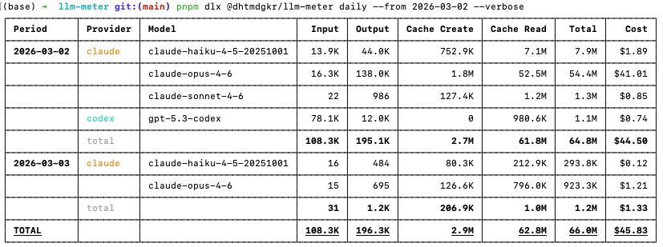

# llm-meter

A CLI tool that provides unified analysis of local token usage across three AI coding tools: Claude Code, Codex CLI, and Gemini CLI.

All analysis is performed locally — no external API calls.

## Usage

```bash
# Daily usage (default)
pnpm dlx @dhtmdgkr/llm-meter
npx @dhtmdgkr/llm-meter
bunx @dhtmdgkr/llm-meter

# Monthly usage
pnpm dlx @dhtmdgkr/llm-meter monthly

# Specify date range
pnpm dlx @dhtmdgkr/llm-meter daily --from 2026-03-01 --to 2026-03-02

# Filter by provider
pnpm dlx @dhtmdgkr/llm-meter daily --from 2026-03-01 --provider claude

# Per-model breakdown
pnpm dlx @dhtmdgkr/llm-meter daily --from 2026-03-01 --verbose

# JSON output
pnpm dlx @dhtmdgkr/llm-meter daily --from 2026-03-01 --json
```

### Options

| Option | Description |
|--------|-------------|
| `--from <date>` | Start date (YYYY-MM-DD), default: 30 days ago |
| `--to <date>` | End date (YYYY-MM-DD), default: today |
| `--provider <name>` | Filter by provider: `claude`, `codex`, `gemini` |
| `--verbose` | Show per-model breakdown |
| `--json` | Output as JSON |

## Output Example



## Data Sources

| Provider | Local Path | Format |
|----------|-----------|--------|
| **Claude Code** | `~/.claude/projects/**/*.jsonl` | JSONL, `message.usage` from `type: "assistant"` records |
| **Codex CLI** | `~/.codex/sessions/YYYY/MM/DD/rollout-*.jsonl` | JSONL, last `token_count` cumulative value per session |
| **Gemini CLI** | `~/.gemini/tmp/**/session-*.json` | JSON, `tokens` from `type: "gemini"` entries in `messages[]` |

## Pricing Model

Uses [LiteLLM](https://github.com/BerriAI/litellm)-based pricing data (same as ccusage).

| Model | Input $/MTok | Output $/MTok | Cache Create $/MTok | Cache Read $/MTok |
|-------|:-----------:|:------------:|:------------------:|:----------------:|
| Claude Opus 4 | $5.00 | $25.00 | $6.25 | $0.50 |
| Claude Sonnet 4 | $3.00 | $15.00 | $3.75 | $0.30 |
| Claude Haiku 4.5 | $1.00 | $5.00 | $1.25 | $0.10 |
| GPT-5.3 Codex | $1.75 | $14.00 | - | $0.175 |
| GPT-5.4 | $2.50 | $15.00 | - | $0.25 |
| Codex Mini | $1.50 | $6.00 | - | $0.375 |
| o3 | $2.00 | $8.00 | - | $0.50 |
| o4-mini | $1.10 | $4.40 | - | $0.275 |
| Gemini 2.5 Pro | $1.25 | $10.00 | - | $0.125 |
| Gemini 2.5 Flash | $0.30 | $2.50 | - | $0.03 |

Tiered pricing applies above 200K tokens (Claude Opus/Sonnet, Gemini 2.5 Pro) and 272K tokens (GPT-5.4).

## Testing

```bash
bun test
```

## Compatibility with ccusage

The Claude Code portion produces identical results to [ccusage](https://github.com/ryoppippi/ccusage):

- LiteLLM pricing model
- Local timezone-based date grouping
- Includes subagent files

## Project Structure

```
src/
  index.ts                  # CLI entry point
  cli/
    commands/daily.ts       # daily subcommand
    commands/monthly.ts     # monthly subcommand
    commands/shared.ts      # shared data collection logic
    options.ts              # CLI option definitions
    output/table.ts         # terminal table formatter
    output/json.ts          # JSON output formatter
  core/
    types.ts                # shared types
    aggregator.ts           # daily/monthly aggregation
    date-utils.ts           # date utilities
  providers/
    base.ts                 # abstract base class
    claude.ts               # Claude Code parser
    codex.ts                # Codex CLI parser
    gemini.ts               # Gemini CLI parser
    registry.ts             # provider registry
  pricing/
    models.ts               # per-model pricing database
    calculator.ts           # cost calculation (tiered pricing)
tests/
  fixtures/                 # synthetic test data
  providers/                # provider unit tests
  core/                     # aggregation unit tests
```

## License

MIT
